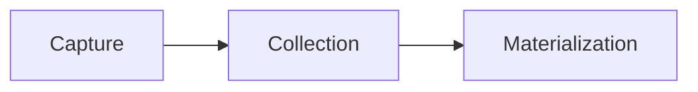
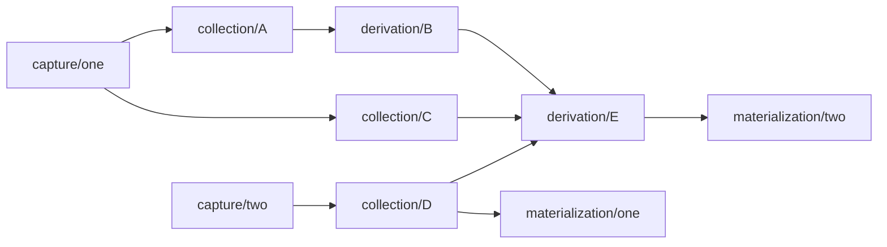

## Data Flows[​](#data-flows "Direct link to Data Flows")

You can mix and match catalog entities to create a variety of Data Flows.

The simplest Data Flow has just three entities.

It may also be more complex, combining multiple entities of each type.

## Flow specification files[​](#flow-specification-files "Direct link to Flow specification files")

Catalog entities are defined and described in Flow **specification files.** These YAML files contain the configuration details that each entity requires.

You work on specification files as **drafts** before you publish them to a catalog.

There are two ways to create and work with specification files.

### In the Flow web app[​](#in-the-flow-web-app "Direct link to In the Flow web app")

You don't need to write or edit the specification files directly — the web app is designed to generate them for you. You do have the option to review and edit the generated specification as you create captures and materializations using the **Catalog Editor**.

### With flowctl[​](#with-flowctl "Direct link to With flowctl")

If you prefer a developer workflow, you can also work with specification files directly in your local environment using [flowctl](/concepts/flowctl/). You then **publish** them back to the catalog.

A given Data Flow may be described by one specification file, or by many, so long as a top-level file [imports](/concepts/import/) all the others.

The files use the extension `*.flow.yaml` or are simply named `flow.yaml` by convention. Using this extension activates Flow's VS Code integration and auto-complete. Flow integrates with VS Code for development environment support, like auto-complete, tooltips, and inline documentation.

Depending on your Data Flow, you may also have TypeScript modules, JSON schemas, or test fixtures.

## Namespace[​](#namespace "Direct link to Namespace")

All catalog entities (captures, materializations, and collections) are identified by a **name** such as `acmeCo/teams/manufacturing/anvils`. Names have directory-like prefixes and every name within Flow is globally unique.

If you've ever used database schemas to organize your tables and authorize access, you can think of name prefixes as being akin to database schemas with arbitrary nesting.

All catalog entities exist together in a single **namespace**. As a Flow customer, you're provisioned one or more high-level prefixes for your organization. Further division of the namespace into prefixes is up to you.

Prefixes of the namespace, like `acmeCo/teams/manufacturing/`, are the foundation for Flow's [authorization model](/reference/authentication/).

[Edit this page](https://github.com/estuary/flow/edit/master/site/docs/concepts/catalogs.md)
