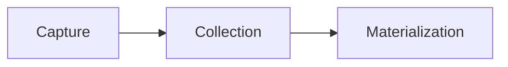

The web app is the central, low-code environment for creating, managing, and monitoring Data Flows.

## When to use the web app[​](#when-to-use-the-web-app "Direct link to When to use the web app")

The web app and [flowctl](/concepts/flowctl/) are designed to work together as a complete platform. You can use either, or both, to work on your Data Flows, depending on your preference.

With the Flow web app, you can perform most common workflows, including:

* Creating end-to-end Data Flows: **capturing** data from source systems and **materializing** it to destinations.
* Creating, viewing, and editing individual captures and materializations.
* Monitor the amount of data being processed by the system.
* Viewing data **collections**.
* Viewing users and permissions.
* Granting permissions to other users.
* Authenticating with the flowctl CLI.
* Managing billing details.

Some advanced workflows, like transforming data with **derivations**, aren't fully available in the web app.

Even if you prefer the command line or plan to perform a task that's only available through flowctl, we recommend you begin your work in the web app; it provides a quicker and easier path to create captures and materializations. You can then switch to flowctl to continue working.

## Signing in[​](#signing-in "Direct link to Signing in")

You use a Google, Microsoft, or GitHub account to sign into Flow. Alternatively, [contact us](https://estuary.dev/contact-us) about Single Sign-On (SSO) options.

If you've never used Flow before, you'll be prompted to register before being issued a trial account. If you want to use Flow for production workflows or collaborate with team members, you'll need an organizational account. [Contact Estuary](mailto:support@estuary.dev) to create a new organizational account or join an existing organization.

## Navigating the web app[​](#navigating-the-web-app "Direct link to Navigating the web app")

When you log into the web app, you land on the **Welcome** page. There are four additional pages visible as tabs in the side navigation: **Sources (captures)**, **Collections**, **Destinations (materializations)**, and **Admin**.

The order of the tabs mirrors the order of a basic Data Flow:

While you may choose to [use the tabs in this sequence](/guides/create-dataflow/), it's not necessary. All Flow entities exist individually, outside of the context of a complete Data Flow. You can use the different pages in the web app to monitor and manage your items in a number of other ways, as described below.

## Captures page[​](#captures-page "Direct link to Captures page")

The **Captures** page shows you a table of existing Flow [captures](/concepts/captures/) to which you have [access](/reference/authentication/). The **New Capture** button is also visible. You can use the table to monitor your captures.

**1:** Select all or deselect all.

**2:** Enable, Disable, and Delete buttons. These actions will be applied to the selected table rows. Choose **Disable** to temporarily pause the flow of data, **Enable** to resume, and **Delete** to permanently remove the capture(s).

**3:** Materialize button. When you click this button, you're directed to the **Create Materializations** page. All the collections of the selected capture(s) will be added to the materialization.

**4:** Filter captures. Type a catalog prefix, unique capture name, or connector name to return captures that match your query.

Capture names follow the pattern `prefix/unique-identifier/connector-name`, with `prefix` supporting multiple layers of nesting. You can search for any part of this full capture name. You can also use the `*` wildcard. For example, if you have a capture called `acmeCo/logistics/anvil-locations/source-postgres`, you can find it by filtering for `acmeCo*source-postgres`.

**5:** Status indicator. Shows the status of the primary task [shard](/concepts/advanced/shards/) that backs this capture.

* **Primary (Green)**: Data is actively flowing through the capture.
* **Pending (Yellow)**: The capture is attempting to re-connect. Often, you'll see this after you re-enable the capture as Flow backfills historical data.
* **Failed (Red)**: The capture has failed with an unrecoverable error.
* **Disabled (Hollow circle)**: The capture is disabled.
* **Unknown (Black when app is in light mode; white when app is in dark mode)**: The web app is unable to determine shard status. Usually, this is due to a temporary connection error.

**6:** Capture name. The full name is shown, including all [prefixes](/concepts/catalogs/#namespace). It is also a link to the [details page](#capture-details-page) of the capture.

**7:** Capture type. The icon shows the type of source system data is captured from.

**8:** Capture [statistics](/concepts/advanced/logs-stats/#statistics). The **Data Written** column shows the total amount of data, in bytes and in [documents](/concepts/collections/#documents), that the capture has written to its associated collections within a configurable time interval. Click the time interval in the header to select from **Today**, **Yesterday**, **This Week**, **Last Week**, **This Month**, **Last Month**, or **All Time**.

**9:** Associated collections. The **Writes to** column shows all the collections to which the capture writes data. For captures with a large number of collections, there is a chip stating how many collections are hidden. Clicking on this will allow you to hover over this column and scroll to view the full list. These also link to the details page of the collection.

**10:** Publish time. Hover over this value to see the exact time the capture was last published.

**11:** Options. Click to open the menu to **Edit Specification**.

### Editing captures and collections[​](#editing-captures-and-collections "Direct link to Editing captures and collections")

When you click **Edit specification** for a capture, you're taken to the **Edit Capture** page.

This page is similar to the [**Create Capture**](#creating-a-capture) page as it was filled out just before the capture was published.

For detailed steps to edit a capture, see the [guide](/guides/edit-data-flows/#edit-a-capture).

### Creating a capture[​](#creating-a-capture "Direct link to Creating a capture")

When you click **Create Capture**, you're taken to the Create Capture page. In the first view, all available capture connectors are displayed.

Select the tile of the system from which you want to capture data to show the full capture form. The form details are specific to the connector you chose.

For detailed steps to create a capture, see the [guide](/guides/create-dataflow/#create-a-capture).

After you successfully publish a capture, you're given the option to materialize the collections you just captured. You can proceed to the materialization, or opt to exit to a different page of the web app.

## Collections page[​](#collections-page "Direct link to Collections page")

The **Collections** page shows a table of [collections](/concepts/collections/) to which you have access. There is also a button to begin a new derivation, or transformation.

The table has nearly all of the same features as the **Captures** table, with several important distinctions that are called out in the image below.

You can use the table to view each collection's specification and see a sample of its data. This can help you verify that collection data was captured as expected and that you'll be able to materialize it how you want, and troubleshoot if necessary.

**1:** Select all or deselect all.

**2:** Enable, Disable, and Delete buttons. These actions will be applied to the selected table rows. Choose **Disable** to temporarily pause the flow of data, **Enable** to resume, and **Delete** to permanently remove the collection(s).

**3:** Filter collections by name. Type a catalog prefix, unique collection name to return collections that match your query.

**4:** Status indicator. If the collection does not contain a [derivation](/concepts/#derivations), the indicator should always show green, and hover text will say "Collection." In the event that the server cannot be reached, the indicator will show "Unknown" status (black in light mode and white in dark mode).

If the collection contains a derivation, the status of the derivation's primary task [shard](/concepts/advanced/shards/) will be indicated:

* **Primary (Green)**: Data is actively flowing through the derivation.
* **Pending (Yellow)**: The derivation is attempting to re-connect.
* **Failed (Red)**: The derivation has failed with an unrecoverable error.
* **Disabled (Hollow circle)**: The derivation is disabled.
* **Unknown (Black when app is in light mode; white when app is in dark mode)**: The web app is unable to determine shard status. Usually, this is due to a temporary connection error.

**5:** Collection name. The full name is shown, including all [prefixes](/concepts/catalogs/#namespace). It is also a link to the [details page](#collection-details-page) of the collection.

**6:** Collection [statistics](/concepts/advanced/logs-stats/#statistics). The **Data Written** column shows the total amount of data, in bytes and in [documents](/concepts/collections/#documents), that has been written to each collection from its associated capture or derivation within a configurable time interval. Click the time interval in the header to select from **Today**, **Yesterday**, **This Week**, **Last Week**, **This Month**, **Last Month**, or **All Time**.

**7:** Publish time. Hover over this value to see the exact time the collection was last published.

## Materializations page[​](#materializations-page "Direct link to Materializations page")

The **Materializations** page shows you a table of existing Flow [materializations](/concepts/materialization/) to which you have [access](/reference/authentication/). The **New Materialization** button is also visible.

You can use the table to monitor your materializations. It's nearly identical to the table on the [Captures page](#captures-page), with a few exceptions.

**1:** Select all or deselect all.

**2:** Enable, Disable, and Delete buttons. These actions will be applied to the selected table rows. Choose **Disable** to temporarily pause the flow of data, **Enable** to resume, and **Delete** to permanently remove the materialization(s).

**3:** Filter materializations by name. Type a catalog prefix, unique materialization name, or connector name to return materializations that match your query.

Materialization names follow the pattern `prefix/unique-identifier/connector-name`, with `prefix` supporting multiple layers of nesting. You can search for any part of this full materialization name. You can also use the `*` wildcard. For example, if you have a materialization called `acmeCo/anvil-locations/materialize-mysql`, you can find it by filtering for `acmeCo*mysql`.

**4:** Status indicator. Shows the status of the primary task [shard](/concepts/advanced/shards/) that backs this materialization.

* **Primary (Green)**: Data is actively flowing through the materialization.
* **Pending (Yellow)**: The materialization is attempting to re-connect. Often, you'll see this after you re-enable the materialization as Flow backfills historical data.
* **Failed (Red)**: The materialization has failed with an unrecoverable error.
* **Disabled (Hollow circle)**: The materialization is disabled.
* **Unknown (Black when app is in light mode; white when app is in dark mode)**: The web app is unable to determine shard status. Usually, this is due to a temporary connection error.

**5:** Materialization name. The full name is shown, including all [prefixes](/concepts/catalogs/#namespace). It is also a link to the [details page](#materialization-details-page) of the materialization.

**6:** Materialization type. The icon shows the type of destination system data is materialized to.

**7:** Materialization [statistics](/concepts/advanced/logs-stats/#statistics). The **Data Read** column shows the total amount of data, in bytes and in [documents](/concepts/collections/#documents), that the materialization has read from its associated collections within a configurable time interval. Click the time interval in the header to select from **Today**, **Yesterday**, **This Week**, **Last Week**, **This Month**, **Last Month**, or **All Time**.

**8:** Associated collections. The **Reads from** column shows all the collections from which the materialization reads data. For materializations with a large number of collections, there is a chip stating how many collections are hidden. Clicking on this will allow you to hover over this column and scroll to view the full list. These also link to the details page of the collection.

**9:** Publish time. Hover over this value to see the exact time the materialization was last published.

**10:** Options. Click to open the menu to **Edit Specification**.

### Editing materializations[​](#editing-materializations "Direct link to Editing materializations")

When you click **Edit specification** for a materialization, you're taken to the **Edit Materialization** page.

This page is similar to the [**Create Materialization**](#creating-a-materialization) page as it was filled out just before the materialization was published.

For detailed steps to edit a materialization, see the [guide](/guides/edit-data-flows/#edit-a-materialization).

### Creating a materialization[​](#creating-a-materialization "Direct link to Creating a materialization")

There are three ways to begin creating a materialization:

* Clicking **New Materialization** on the Materializations page.
* Selecting one or more captures from the Captures page and clicking **Materialize**.
* Clicking **Materialize Collections** immediately after publishing a capture.

When you initiate the workflow in any of these ways, all available materialization connectors are displayed. Select a connector to reveal the full form with configuration options specific to your desired destination.

Fill out the **Endpoint Config** form and in the **Source Collections** section use the **Collection Selector** to map Flow collections to resources in the destination system.

Note that if you entered the workflow from the Captures page or after publishing a capture, collections will be pre-populated for you.

For detailed steps to create a materialization, see the [guide](/guides/create-dataflow/#create-a-materialization).

## Capture Details page[​](#capture-details-page "Direct link to Capture Details page")

When you click on the **name** of a capture on the [captures page](#captures-page) you will be taken to the capture details page to view data stats, sharding information, and general details.

### Overview Tab[​](#overview-tab "Direct link to Overview Tab")

**1:** The full name of the capture.

**2:** Capture [statistics](/concepts/advanced/logs-stats/#statistics). The **Usage** section displays the total amount of data, in bytes and in [documents](/concepts/collections/#documents) written by the capture, per hour. The number of hours being displayed in the chart can be changed by clicking the time interval in the header to select from **6 hours**, **12 hours**, **24 hours**, **48 hours**, or **30 days**.

**3:** The **Details** section shows information about the capture: when it was last updated, when it was created, the connector being used, and the collections to which the capture writes data.

**4:** Detailed tooltip. You can hover over a section in the graph to see the specific data of that hour.

**5:** The most recent hour. This will automatically update every 15 seconds with the most recent data and docs.

**6:** Associated collections. Shows all the collections to which the capture writes data and when clicked will take you to the collection's [detail page](#collection-details-page).

**7:** The **Shard Information** section shows the full identifier of the shard(s) that back your capture. If there's an error, you'll see an alert identifying the failing shard(s). Use the drop-down to open an expanded view of the failed shard's logs.

### Spec Tab[​](#spec-tab "Direct link to Spec Tab")

In the **Spec** tab, you can view the specification of the capture itself.

## Collection Details page[​](#collection-details-page "Direct link to Collection Details page")

When you click on the **name** of a collection on the [collections page](#collections-page) you will be taken to the collection details page to view data stats, sharding information, preview of data, and general details.

### Overview Tab[​](#overview-tab-1 "Direct link to Overview Tab")

**1:** The full name of the collection.

**2:** Collection [statistics](/concepts/advanced/logs-stats/#statistics). The **Usage** section shows the total amount of data, in bytes and in [documents](/concepts/collections/#documents) passing through a collection, per hour. The number of hours being displayed in the chart can be changed by clicking the time interval in the header to select from **6 hours**, **12 hours**, **24 hours**, **48 hours**, or **30 days**.

**3:** The **Details** section shows information about the collection: when it was last updated, when it was created, and the associated collections (if any).

**4:** Detailed tooltip. You can hover over a section in the graph to see the specific data of that hour.

**5:** The most recent hour. This will automatically update every 15 seconds with the most recent data and docs.

**6:** Associated collections. Shows source collections that this collection reads from. Click to go to the collection's [detail page](#collection-details-page).

**7:** The **Shard Information** section (for derivations) shows the full identifier of the shard(s) that back your derivation. If there's an error, you'll see an alert identifying the failing shard(s). Use the drop-down to open an expanded view of the failed shard's logs.

**8:** The **Data Preview** section shows a sample of collection [documents](/concepts/collections/#documents): the individual JSON files that comprise the collection. Documents are organized by their collection key value. Click a key from the list to view its document.

### Spec Tab[​](#spec-tab-1 "Direct link to Spec Tab")

**1:** The collection's [key](/concepts/collections/#keys) of the collection.

**2:** The collection's [schema](/concepts/schemas/) displayed in a read only table. The table columns can be sorted to more easily find what you need.

<Check>
  If you need to modify a collection, edit the [capture](/concepts/captures/) or [derivation](/concepts/derivations/) that provides its data.
</Check>

## Materialization Details Page[​](#materialization-details-page "Direct link to Materialization Details Page")

When you click on the **name** of a materialization on the [materializations page](#materializations-page) you will be taken to the detail page to view data stats, sharding information, and general details.

### Overview Tab[​](#overview-tab-2 "Direct link to Overview Tab")

**1:** The full name of the materialization.

**2:** Materialization [statistics](/concepts/advanced/logs-stats/#statistics). The **Usage** section shows the total amount of data, in bytes and in [documents](/concepts/collections/#documents) read by a materialization, per hour. The number of hours being displayed in the chart can be changed by clicking the time interval in the header to select from **6 hours**, **12 hours**, **24 hours**, **48 hours**, or **30 days**.

**3:** The **Details** section shows information about the materialization: when it was last updated, when it was created, and the associated collections.

**4:** Detailed tooltip. You can hover over a section in the graph to see the specific data of that hour.

**5:** The most recent hour. This will automatically update every 15 seconds with the most recent data and docs.

**6:** Associated collections. Shows all the collections that provide data to this materialization. Click to go to the collection's [detail page](#collection-details-page).

**7:** The **Shard Information** section shows the full identifier of the shard(s) that back your materialization. If there's an error, you'll see an alert identifying the failing shard(s). Use the drop-down to open an expanded view of the failed shard's logs.

### Spec Tab[​](#spec-tab-2 "Direct link to Spec Tab")

In the **Spec** tab, you can view the specification of the materialization itself.

## Admin page[​](#admin-page "Direct link to Admin page")

On the **Admin** page, you can view users' access grants, your organization's cloud storage locations, and a complete list of connectors. You can also get an access token to authenticate with flowctl and manage billing information.

### Account Access[​](#account-access "Direct link to Account Access")

The **Account Access** tab shows you all provisioned access grants on objects to which you also have access. Both users and catalog prefixes can receive access grants. These are split up into two tables called **Organization Membership** and **Data Sharing**. Each access grant has its own row, so a given user or prefix may have multiple rows.

For example, if you had read access to `foo/` and write access to `bar/`, you'd have a separate table row in the **Organization Membership** table for each of these capabilities. If users Alice, Bob, and Carol each had write access on `foo/`, you'd see three more table rows representing these access grants.

Taking this a step further, the prefix `foo/` could have read access to `buz/`. You'd see this in the **Data Sharing** table, and it'd signify that everyone who has access to `foo/` also inherits read access to `buz/`.

Use the search boxes to filter by username, prefix, or object.

You can manage access by generating new user invitations, granting data sharing access, or selecting users or prefixes to revoke access.

Generating a new invitation will create a URL with a grant token parameter. This token will allow access based on the prefix, capability, and type you select. Copy the URL and share it with its intended recipient to invite them to your organization.

[Learn more about capabilities and access.](/reference/authentication/)

### Settings[​](#settings "Direct link to Settings")

The **Settings** tab includes additional configuration, such as organization notifications and storage mappings.

#### Organization Notifications[​](#organization-notifications "Direct link to Organization Notifications")

Here, you are able to configure which email address(es) will receive [notifications](/reference/notifications/) related to your organization or prefix.

#### Cloud Storage[​](#cloud-storage "Direct link to Cloud Storage")

This section provides a table of the cloud storage locations that back your Flow collections. You're able to view the table if you're an admin.

Each top-level Flow [prefix](/concepts/catalogs/#namespace) is backed by one or more cloud storage bucket that you own. You typically have just one prefix: your organization name, which you provided when configuring your Flow organizational account. If you're a trial user, your data is stored temporarily in Estuary's cloud storage bucket for your trial period.

[Learn more about storage mappings.](/concepts/storage-mappings/)

#### Data Planes[​](#data-planes "Direct link to Data Planes")

The **Data Planes** section provides a table of all available data plane options, broken out by **Private** and **Public** data planes.

You can find information here related to connecting and allowing access to your data plane of choice. See [Allowlisting IP Addresses](/reference/allow-ip-addresses/) for more.

### Billing[​](#billing "Direct link to Billing")

The **Billing** tab allows you to view and manage information related to past usage, the current billing cycle, and payment methods.

Your usage is broken down by the amount of data processed and number of task hours. View usage trends across previous months in the **Usage by Month** chart and preview your bill based on usage for the current month. If you are on the free tier (up to 2 connectors and 10 GB per month), you will still be able to preview your bill breakdown, and will have a "Free tier credit" deduction. To help estimate your bill, also see the [Pricing Calculator](https://estuary.dev/pricing/#pricing-calculator).

To pay your bill, add a payment method to your account. You can choose to pay via card or bank account. You will not be charged until you exceed the free tier's limits.

### Connectors[​](#connectors "Direct link to Connectors")

The **Connectors** tab offers a complete view of all connectors that are currently available through the web application, including both capture and materialization connectors. If a connector you need is missing, you can [request it](https://github.com/estuary/connectors/issues/new/choose).

### CLI-API[​](#cli-api "Direct link to CLI-API")

The **CLI-API** tab provides the access token required to [authenticate with flowctl](/reference/authentication/#authenticating-flow-using-the-cli). You can also revoke old tokens.

[Edit this page](https://github.com/estuary/flow/edit/master/site/docs/concepts/web-app.md)
